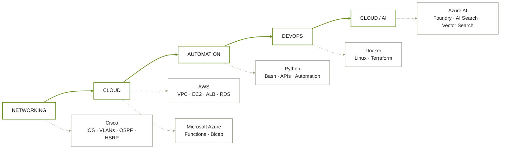
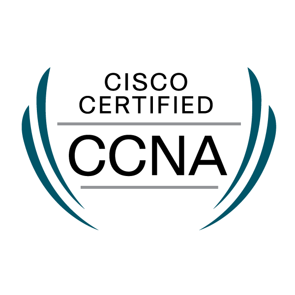
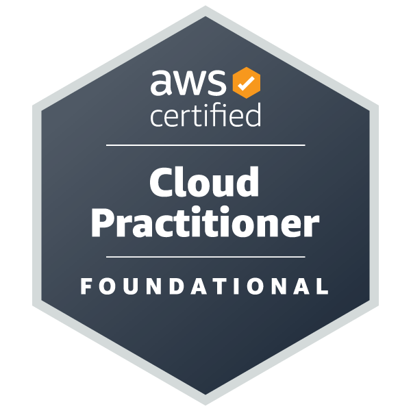
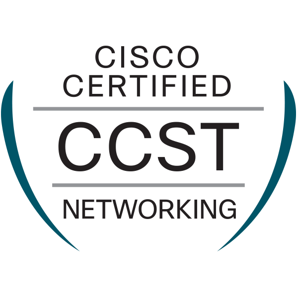

<div align="center">


<br>


<br><br>


<br><br>


</div>

---

## `> whoami`

```text
Stephen Alegros
────────────────────────────────────────────────────────────

Focus       : Cloud Infrastructure • Networking • DevOps
Education   : BSc Computer Science — University of the People
Location    : Philippines

Background  : Networking, cloud infrastructure, automation
              and systems engineering

Goal        : Cloud / DevOps / Cisco DevNet Engineering

Approach    : Understand the system → build it → troubleshoot it
              → automate it
```

---

## `> about`

I'm a self-directed IT/CS student building toward **Cloud Infrastructure, DevOps, and Network Automation**.

My background started around networking and infrastructure before expanding into cloud architecture, containerization, automation, serverless systems, and AI-enabled infrastructure.

I particularly enjoy projects where multiple infrastructure layers have to work together — networks routing traffic, containers running services, APIs moving data, and cloud systems responding to events.

### Technical progression



## `> stack`

### Cloud & Infrastructure
`AWS` `Azure` `Docker` `Linux` `Terraform` `Bicep`
`VPC` `EC2` `ALB` `RDS` `Azure Functions`

### Networking
`Cisco IOS` `VLANs` `OSPF` `HSRP` `STP` `EtherChannel` `ACLs` `SSH` `MQTT`

### Languages & Frameworks
`Python` `C` `C#` `Bash` `FastAPI` `HTML`

### AI & Data
`Azure AI Foundry` `Azure AI Search` `Vector Search`
`LLM Applications` `Multi-Agent Systems`

## `> certifications`

<div align="center">

<table>
<tr>

<td align="center" width="25%">
  <a href="https://www.credly.com/badges/fada4d82-5d1b-44b6-955a-6ec47f003abe/public_url">
    
  </a><br>
  <strong>CCNA</strong><br>
  <sub><code>CERTIFIED</code></sub>
</td>

<td align="center" width="25%">
  <a href="https://www.credly.com/badges/ebc9e240-1635-4b54-87be-19912f779177/public_url">
    
  </a><br>
  <strong>Security+</strong><br>
  <sub><code>CERTIFIED</code></sub>
</td>

<td align="center" width="25%">
  <a href="https://www.credly.com/badges/e613925d-b003-4f1b-a134-e4d052580783/public_url">
    
  </a><br>
  <strong>AWS Cloud Practitioner</strong><br>
  <sub><code>CERTIFIED</code></sub>
</td>

<td align="center" width="25%">
  <a href="https://www.credly.com/badges/8b8f3128-7373-4eba-ab11-424bc3706bcb/public_url">
    
  </a><br>
  <strong>CCST Networking</strong><br>
  <sub><code>CERTIFIED</code></sub>
</td>

</tr>
</table>

<br>

<table>
<tr>

<td align="center" width="25%">
  <br><br>
  <strong>AutoCAD ATC</strong><br>
  <sub><code>CERTIFIED</code></sub>
</td>
 
<td align="center" width="50%">
  <div>
    
    <br>
    
  </div>
  <br>
  <strong>HKUST Big Data</strong><br>
  <sub><code>IN PROGRESS</code></sub>
</td>

</tr>
</table>

</div>

---

## `> projects`

<table>
<tr>
<td width="50%" valign="top">

### CRUCIBLE Enterprise

**Voice-first multi-agent certification readiness platform**

Built for the Microsoft Foundry Hackathon.

Six specialized AI agents conduct live spoken interrogation against a grounded knowledge base and generate:

* Readiness scores
* Training recommendations
* Team analytics
* Knowledge-grounded responses

**Stack**

`Azure AI Foundry`
`Azure Voice Live`
`Azure AI Search`
`FastAPI`
`Python`

<a href="https://github.com/steeppn/crucible-enterprise">

</a>

</td>

<td width="50%" valign="top">

### AWS Three-Tier Infrastructure

**Production-style cloud architecture**

Designed and deployed in `ap-southeast-2`.

Features:

* Multi-AZ architecture
* Custom VPC
* Auto Scaling
* Chained Application Load Balancers
* RDS backend
* Tier-specific security groups
* Least-privilege access model

**Stack**

`AWS VPC`
`EC2` `Auto Scaling`
`ALB` `RDS` `IAM`

<a href="https://github.com/steeppn/AWS-Three-Tier-Web-Application---Alegros">

</a>

</td>
</tr>

<tr>
<td width="50%" valign="top">

### IoT Motor Telemetry

**Industrial IoT simulation and serverless pipeline**

ESP32 telemetry → MQTT → Lambda → DynamoDB → dashboard.

Includes:

* Motor temperature monitoring
* Current monitoring
* Automated fault detection
* Safety interlocks
* Real-time telemetry dashboard
* Local AWS simulation through LocalStack

**Stack**

`ESP32` `MQTT`
`Lambda` `DynamoDB`
`LocalStack` `Docker` `Streamlit`

<a href="https://github.com/steeppn/IoT-Enabled-Motor-Control-System">

</a>

</td>

<td width="50%" valign="top">

### Enterprise Network Capstone

**Three-tier enterprise network**

Designed around a dual-router / dual-distribution architecture.

Includes:

* VLAN segmentation
* OSPF routing
* HSRP gateway redundancy
* RPVST+
* Layered ACLs
* SSH-only management
* WPA2-PSK wireless
* Isolated guest network

**Stack**

`Cisco IOS`
`VLAN` `OSPF` `HSRP`
`STP` `ACL` `SSH`

<a href="https://github.com/steeppn/ccna_overall_project-alegros">

</a>

</td>
</tr>
</table>

---

## `> contact`

<div align="center">

<a href="https://github.com/steeppn">

</a>

<a href="https://linkedin.com/in/YOUR-LINKEDIN">

</a>

<a href="mailto:YOUR-EMAIL">

</a>

<br><br>


</div>
